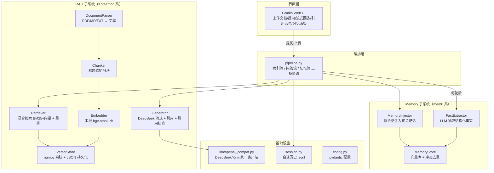

# MemoDoc 架构说明

## 1. 总架构



## 2. 三条数据流

| 数据流 | 路径 | 说明 |
| --- | --- | --- |
| 索引流 | 文档 → Parser → Chunker → Embedder → 向量库 | "把知识存进去"，上传时触发 |
| 问答流 | 问题 → [系统提示 + 相关记忆 + 会话历史 + 检索片段] → LLM 流式生成 + [n] 引用 | "带着知识和记忆回答" |
| 记忆流 | 每轮后 → LLM 抽取事实（身份/偏好）→ 去重/冲突更新入库；新会话 → 相关记忆注入 | "跨会话记住你"（mem0 基因） |

## 3. 模块清单

```
src/memodoc/
├── config.py             # pydantic-settings 配置（.env / 环境变量）
├── llm/openai_compat.py  # DeepSeek/Kimi 统一客户端（chat / stream / json）
├── rag/
│   ├── parser.py         # PyMuPDF + 文本解析
│   ├── chunker.py        # 标题感知分块（滑窗 + 重叠）
│   ├── embedder.py       # bge-small-zh 本地向量化（失败自动降级）
│   ├── store.py          # 自研向量库（numpy 余弦 + JSON 持久化）
│   ├── sparse.py         # 手写 BM25 稀疏索引（中英文自适应分词）
│   ├── reranker.py       # 交叉编码器重排（bge-reranker-v2-m3）
│   ├── retriever.py      # 混合融合 + 跨语言双语检索 + 文档路由 + 重排
│   └── generator.py      # 系统提示 + 强制 [n] 引用
├── memory/
│   ├── extractor.py      # LLM 抽取结构化事实
│   ├── store.py          # 记忆向量库 + 去重 + 冲突更新
│   └── injector.py       # 新会话注入相关记忆
├── session.py            # 会话历史 jsonl
├── pipeline.py           # 三条链路编排
└── cli.py                # 命令行入口
```

## 4. 关键实现细节

- **引用编号与来源一一对应**：检索结果按顺序编号 `[1..k]` 写进系统提示；生成文本里的 `[n]` 直接映射回第 n 个片段，UI 据此高亮来源，从机制上避免"乱标来源"。
- **混合检索（对齐 Kotaemon）**：向量召回 + 手写 BM25 稀疏召回，各自 min-max 归一化后按权重融合（`final = w*dense + (1-w)*sparse`），再交给交叉编码器对 `(query, 片段)` 逐对精排，取 top_k。
- **跨语言检索**：中文查询先经 LLM 翻译成英文，中英双语各自走"向量+BM25"融合召回后按片段合并（保留更高分），再由多语言重排器精排；BM25 分词按文档语言自动切换（中文 jieba / 英文词切分），分词器版本变更时旧索引自动重建。
- **文档路由**：检索前用「完整标题子串 → 连字符缩写（如 agent-os）→ 英文词重叠≥2」三级匹配定位目标文档，命中则域内检索；路由落空自动回退全局检索。
- **逻辑空间**：物理层 `data/uploads/<租户>/<生命周期>/` 归档源文件；逻辑层向量库保持扁平，以 chunk meta 的 `tenant/lifecycle/tags` 虚拟标签组织，检索支持按租户/生命周期/标签过滤（旧数据加载时自动补齐默认值）。
- **引用核查（对齐 Kotaemon CitationPipeline）**：生成后由 LLM 逐条判定每个 `[n]` 是否被对应片段支持，UI 用「✓已核查 / ⚠不支持」徽标展示，构成"生成—溯源—验证"闭环。
- **记忆增强检索**：查询先加 bge 中文指令前缀（`为这个句子生成表示以用于检索相关文章：`）；有相关记忆时把记忆事实拼进查询再检索（如"我是大一新生，还需要交会费吗"），个性化问题的命中率显著提升。
- **记忆去重**：新事实向量化后与库中最近邻比较，相似度 ≥ 0.85 判为重复跳过；同 `subject` 且同 `type` 判为冲突，用新事实替换旧事实。
- **降级链路**：embedding 或重排模型不可用 → 自动降级（纯向量 / 纯 BM25），保证"没有模型也能演示"。
- **为什么不用 ChromaDB**：本机无 MSVC 构建工具，ChromaDB 依赖的 chroma-hnswlib 无 Windows/3.12 预编译 wheel（需源码编译）。演示规模（数百块）下 O(n) 精确检索毫秒级完成，JSON 存储可审计、零原生依赖；`store.py` 接口与 ChromaDB 对齐，后续可无缝替换。

## 5. 诚实的效果预期

- **可保证**：架构跑通——全部是成熟库拼装，无未验证技术。
- **高把握**：7 天内完成 v1（前提是每日 4–6h 投入）。
- **不保证、也不需要保证**：效果上限（引用准确率多高、回答多好）。答辩要的是"架构清晰 + 引用真实 + 指标诚实"，用受控演示剧本锁定效果，不赌运气。
