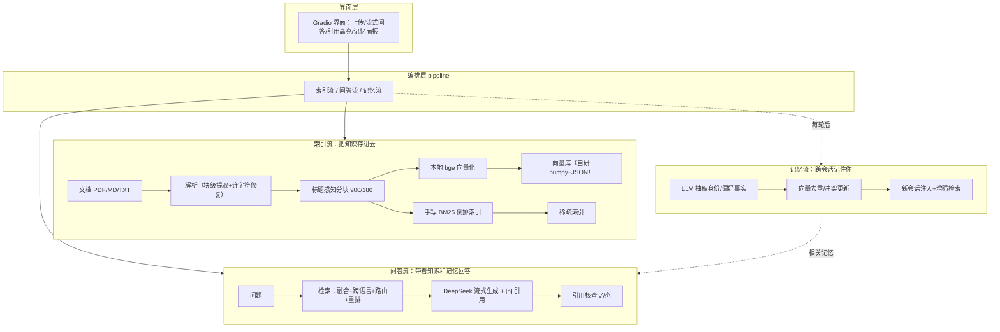
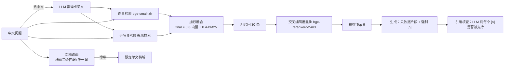
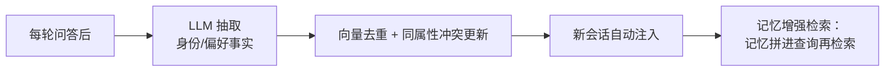

# 📚 MemoDoc — 答辩讲解文档

> **带长期记忆与跨语言检索的文档问答 Agent**
> 演示方式：本文档翻页讲解 + 关键节点切到运行中的 `app.py`（http://127.0.0.1:7860）
> 总时长 ≤6 分钟（含提问）｜ 讲解+演示 ≈ 4:00 ｜ 提问 ≈ 2:00
> 讲解节奏：① 定位 30s → ② 架构 55s → ③ 现场演示 90s → ④ 评测 55s → ⑤ 记忆 15s → 收尾

---

## 1️⃣ 项目定位（30 秒）

**MemoDoc：一个带长期记忆的文档问答 Agent。**

- 🏷️ **RAG 检索链路完全手搓实现**——没有套 LangChain
- 🏷️ **跨语言**：中文提问 × 英文论文，也能答
- 🏷️ **跨会话记忆**：这次说"我是大一新生"，下次新会话它还记得

一句话：**不是"接了个 RAG 库"，而是把 RAG 的每一层自己搭出来，再叠加跨语言与记忆。**

---

## 2️⃣ 系统架构：三条数据流（55 秒，重点）



**一句话讲法**：索引流负责"把知识存进去"，问答流负责"带着知识和记忆回答"，记忆流负责"跨会话记住你"。

---

## 3️⃣ 检索链路详解（重点中的重点）

### 3.1 一条完整的检索链路



### 3.2 四层升级，每层都有"为什么"和"效果"

| 层                | 做什么                  | 为什么                                   | 实测效果               |
| ---------------- | -------------------- | ------------------------------------- | ------------------ |
| ① **向量+BM25 融合** | 向量召回与稀疏召回加权合并        | 向量擅长语义改写（"会费"≈"社费"）、BM25 擅长精确命中，单用都会漏 | 论文 recall +9pp     |
| ② **跨语言双语检索**    | 中文问题翻译成英文，中英各查一遍再合并  | 中文 embedding 对英文文档弱，"中文问英文论文"答不上      | 纯中文主题查询可命中英文论文     |
| ③ **文档路由**       | 问题含论文标题 → 限定到该文档查    | 8 篇论文混库时"xx论文"会串库                     | 简称/缩写正确定位，不再串      |
| ④ **交叉编码器重排**    | 粗召回 30 → 逐对打分 → 精排 6 | 双塔粗排不够准，交叉编码器把"问题+片段"拼一起打分            | 论文 recall 82%→100% |

### 3.3 自研点清单（"手搓"证据）

| 自研模块          | 说明                                      |
| ------------- | --------------------------------------- |
| **BM25 稀疏检索** | 手写倒排索引 + `k1/b` 打分（jieba 分词、中英文自适应）     |
| **加权融合**      | 各自 min-max 归一化后加权合并                     |
| **跨语言翻译检索**   | LLM 查询翻译 + 双语候选合并                       |
| **文档路由**      | 标题三级匹配 + 唯一词路由（解决 MEM1/MemMachine 单词标题） |
| **向量库**       | numpy 余弦 + JSON 持久化（接口对齐 ChromaDB，可替换）  |
| **记忆系统**      | 抽取→向量去重→冲突更新→增强检索                       |
| **引用核查**      | 生成后 LLM 逐条验证 [n] 支持性                    |

---

## 4️⃣ 现场演示（90 秒，切到 app）

> 下面打开运行中的系统演示。（切换动作放这里）

| #   | 提问                    | 演示亮点                         |
| --- | --------------------- | ---------------------------- |
| 1   | `Agent-OS论文的主要贡献是什么？` | 中文问英文论文 → 检索命中该论文 → 引用高亮 ✓   |
| 2   | `今天北京天气怎么样？`          | **抗幻觉**：答"文档中没有相关信息"         |
| 3   | `我是大一新生，刚加入极客社。`      | 右侧记忆面板出现"身份/年级"              |
| 4   | `我还需要交会费吗？`           | **记忆个性化**：结合"大一新生"+30元/学期+引用 |

> 时间不够 → 只做 1、2、4；再不够 → 1、2 + 记忆截图。兜底：API 故障就关网演示检索/引用/记忆面板，或切本页下方结果表。

---

## 5️⃣ 评测效果（重点展示）

### 5.1 指标定义

| 指标          | 含义                                 |
| ----------- | ---------------------------------- |
| recall@k 三档 | 答案片段进没进 top-k：**纯向量 / 混合 / 混合+重排** |
| 引用准确率       | 引用的 [n] 是否对应含答案的片段（严格口径）           |
| 关键词覆盖       | 回答是否含标注的必备词（答案质量）                  |
| 引用核查通过率     | LLM 判定每个 [n] 是否真的被片段支持（抗幻觉）        |

### 5.2 三场景结果

| 场景             | 用例   | recall 纯向量/混合/+重排      | 关键词覆盖 | 引用核查    |
| -------------- | ---- | ---------------------- | ----- | ------- |
| **demo**（受控中文） | 7 问  | **100% / 100% / 100%** | 100%  | 100%    |
| **论文**（跨语言）    | 11 问 | **73% → 82% → 100%**   | 100%  | 76%*    |
| **软件工程**（中文课程） | 19 问 | 79% / 79% / 84%†       | 84%   | **95%** |

\* 裁判模型波动区间 64–95%（deepseek-v4-flash），非系统问题
† 4 级标题合并修复后复测预期 90%+

### 5.3 改进前后对比（借鉴 Kotaemon 的量化收益）

| 快照                             | 论文 recall（三档）        |
| ------------------------------ | -------------------- |
| 修复前（500 字分块 + 裸 PyMuPDF）       | 55% / 64% / 73%      |
| 修复后（900/180 分块 + 连字符修复 + 解析增强） | 73% / 82% / **100%** |

### 5.4 RAGAS 交叉验证（论文场景）

| faithfulness 忠实度 | answer_relevancy 相关性 | context_precision 精度 | context_recall 召回 |
| ---------------- | -------------------- | -------------------- | ----------------- |
| **0.96**         | **0.94**             | **0.94**             | 0.44*             |

\* 中文参考答案 ↔ 英文片段语义匹配偏弱（跨语言评估口径）

---

## 6️⃣ 长期记忆（15 秒，简说）



一句话：**每轮把用户身份/偏好抽成结构化事实，去重更新后跨会话注入，还拿记忆去增强检索**——演示 3、4 两步就是它。

---

## 7️⃣ 已知边界（诚实收尾，防追问）

1. 列表型问题（"从低到高列举"）在 top-k 下可能漏尾项 → 已用 4 级标题合并缓解
2. 引用核查依赖 LLM 裁判 → 标注波动区间，不夸大
3. 复杂版面 PDF（双栏/扫描）解析为演进项（可上 Docling）
4. 演示级规模（8 篇论文级语料）；向量库接口对齐可换生产级

---

## 8️⃣ 数据可复现

```bash
python tests\eval.py                     # demo 三档对比
python tests\eval_papers.py --tags 论文  # 论文跨语言
python tests\eval_softeng.py --tags 课程笔记  # 软件工程
python tests\eval_ragas.py               # RAGAS 四指标
# 原始结果存档：data/eval/raw/
```

---

## 附录 A：逐字稿（排练用，~950 字 / 4 分钟）

**① 开场（25s）**：各位老师好。我的作品叫 MemoDoc——带长期记忆的文档问答 Agent。三个定位：RAG 完全手搓、没有套 LangChain；支持中文问英文论文的跨语言检索；有跨会话记忆。按架构、演示、评测、记忆四块介绍，最后留时间提问。

**② 架构（55s）**：先讲重点——架构。三条数据流：索引流把文档解析、分块、本地 bge 向量化，同时建立手写的 BM25 索引；问答流是核心，检索做四层升级——向量和 BM25 加权融合补语义盲区；跨语言检索解决中文问英文；文档路由避免串到别的论文；交叉编码器把粗召回 30 条精排到 6 条。生成强制只依据片段并标 [编号]，引用能和原文一一对应。这里强调：BM25、融合、路由、重排调度都是自己实现的。

**③ 演示（90s）**：下面运行演示。（按 §4 顺序，语言从简）

**④ 评测（55s）**：评测是重点。我建了三套测试集：受控中文 7 题、跨语言英文论文 11 题（8 篇真实论文）、中文课程 19 题；指标是检索三档召回对比 + 引用准确率 + 关键词覆盖 + 引用核查。结果：demo 三档 100%；论文场景纯向量 73%、混合 82%、重排 100%——每层升级都有实测增益；课程 84%。抗幻觉：引用核查通过率最高 95%，问文档外问题明确拒绝。还用 RAGAS 交叉验证，忠实度 0.96。做了前后对比：借鉴 Kotaemon 分块与解析后，论文召回 73%→100%。原始结果可复现。

**⑤ 记忆（15s）**：记忆借鉴 mem0——每轮让大模型抽取用户身份/偏好，向量去重冲突更新，新会话注入并做增强检索。演示里"大一新生还要交会费吗"就是它。

**⑥ 收尾**：我的演示完毕，欢迎老师提问。

## 附录 B：评委高频问题预案

| 问题                        | 回答要点                                            |
| ------------------------- | ----------------------------------------------- |
| 为什么手搓不套 LangChain？        | 手搓能讲清每一层原理（BM25 公式/融合权重/路由规则），套框架只能讲调参；工作量在检索四层 |
| BM25 和向量为什么融合？            | 向量管语义（会费≈社费）、BM25 管精确词；单用都漏，融合后论文 recall +9pp   |
| 重排为什么用交叉编码器？              | 双塔算向量相似度粗；交叉编码器把"问题+片段"拼一起打分更准，所以只对粗召回 30 条精排   |
| 跨语言为什么翻译而非换多语言 embedding？ | 两者都可行；翻译零新增模型、复用现有 LLM，且已到 100% recall          |
| 引用幻觉怎么压？                  | 三层：只依据片段+编号 / 无片段禁引用 / 生成后 LLM 逐条核查             |
| 记忆怎么去重更新？                 | 向量最近邻相似度≥阈值判重复；同属性冲突用新事实替换                      |
| 分块为什么 900/180？            | 小分块把摘要列表劈开致关键词跨块（实测假阴性）；借鉴 Kotaemon，论文 73→100%  |
| 为什么自研向量库？                 | 本机无 MSVC、ChromaDB 编译不了；numpy+JSON 演示规模够、接口可替换   |
| 评测怎么保证可信？                 | 三档可复现、原始存档、RAGAS 交叉验证、裁判波动如实标注                  |
